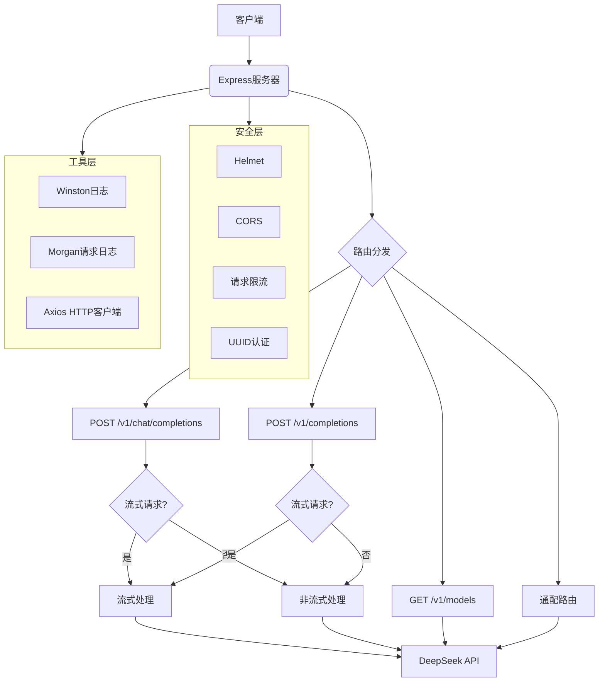

# DeepSeek Proxy 项目架构说明

## 1. 项目概述
该项目是一个基于Node.js的API代理服务，作为DeepSeek API的OpenAI兼容代理（"deepseek-proxy"）。主要功能是将OpenAI格式的API请求转换为DeepSeek API格式，并提供安全、日志和流式响应支持。

## 2. 架构图

## 3. 架构说明
1. **入口层**：Express服务器监听端口，处理所有传入请求
2. **路由层**：将请求分发到特定端点处理器
3. **业务逻辑层**：
   - 专门端点处理OpenAI兼容API
   - 流式/非流式响应处理
   - 请求预处理（添加query_id等）
4. **代理层**：通过Axios将请求转发到DeepSeek API
5. **安全层**：多层安全防护机制
6. **工具层**：日志记录和HTTP客户端

## 4. 关键设计特点
- **流式响应处理**：支持Server-Sent Events(SSE)
- **认证转换**：自动转换API密钥格式
- **错误处理**：统一错误日志和响应格式
- **配置驱动**：通过环境变量控制服务行为
- **模块化设计**：核心功能封装为独立函数